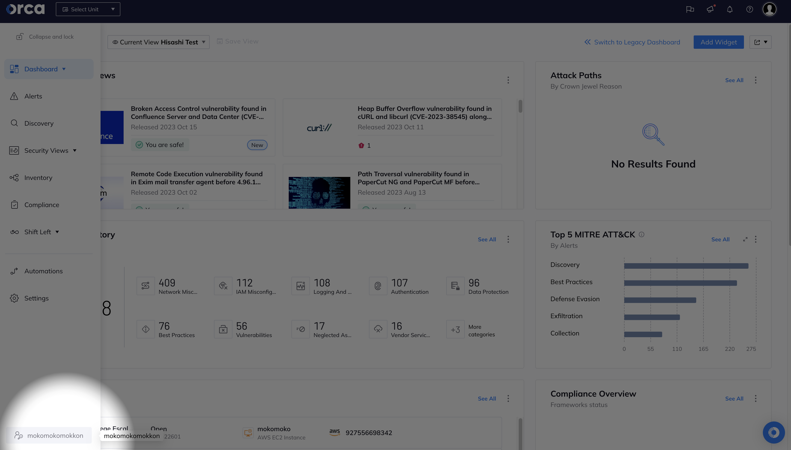

# Orca Security - Terraform Onboarding
Onboard your cloud accounts on Orca Security with Terraform! The repo is a quick tutorial that shows you how you can do it. **Only AWS is available at this point.**
<br>
<br>


## Prerequisites
- Orca Security free trial license - visit [Orca Security](https://orca.security/lp/cloud-security-risk-assessment/) if you don't have a free trial license.
- AWS account.
- GitHub account.
- MacBook with GitHub CLI and Terrafrom.
<br>
<br>


## Onboard
Clone the repo.
<br>
<br>

Grab your Orca Security tenant UUID. You should reach out to Orca representatives with your tenant name. The name can be found on the left bottom of the UI.
<br>
<div align="center">

</div>
<br>

Put your tenant UUID on **role_external_id** in [main.tf](https://github.com/hisashiyamaguchi/orca-onboard-with-terraforma/blob/main/aws/examples/saas/default/main.tf).
<br>

Init and apply. You're going to create Orca IAM Policies & Role on your AWS account.
```shell
$ cd ~/orca-onboard-with-terraforma/aws/examples/saas/default
$ terraform init
$ terraform apply
```
<br>

If your applying goes well, you may find an ARN of your Orca Role - grab it.
```console
Do you want to perform these actions?
  Terraform will perform the actions described above.
  Only 'yes' will be accepted to approve.

  Enter a value: yes

module.orca_aws_onboarding_saas.aws_iam_service_linked_role.scanner_account_rds_service_linked_role[0]: Creating...
module.orca_aws_onboarding_saas.aws_iam_role.role: Creating...
module.orca_aws_onboarding_saas.aws_iam_policy.rds_snapshot_create_policy[0]: Creating...
module.orca_aws_onboarding_saas.aws_iam_policy.rds_snapshot_share_policy[0]: Creating...
module.orca_aws_onboarding_saas.aws_iam_policy.policy[0]: Creating...
module.orca_aws_onboarding_saas.aws_iam_policy.secrets_manager_policy[0]: Creating...
module.orca_aws_onboarding_saas.aws_iam_policy.rds_snapshot_reencrypt_policy[0]: Creating...
module.orca_aws_onboarding_saas.aws_iam_policy.view_only_extras_policy: Creating...
module.orca_aws_onboarding_saas.aws_iam_policy.secrets_manager_policy[0]: Creation complete after 1s [id=arn:aws:iam::xxxx:policy/OrcaSecuritySecretsManagerPolicy]
module.orca_aws_onboarding_saas.aws_iam_policy.rds_snapshot_share_policy[0]: Creation complete after 1s [id=arn:aws:iam::xxxx:policy/OrcaRdsSnapshotSharePolicy]
module.orca_aws_onboarding_saas.aws_iam_service_linked_role.scanner_account_rds_service_linked_role[0]: Creation complete after 1s [id=arn:aws:iam::xxxx:role/aws-service-role/rds.amazonaws.com/AWSServiceRoleForRDS]
module.orca_aws_onboarding_saas.aws_iam_policy.policy[0]: Creation complete after 2s [id=arn:aws:iam::xxxx:policy/OrcaSecurityPolicy]
module.orca_aws_onboarding_saas.aws_iam_policy.rds_snapshot_create_policy[0]: Creation complete after 2s [id=arn:aws:iam::xxxx:policy/OrcaRdsSnapshotCreatePolicy]
module.orca_aws_onboarding_saas.aws_iam_policy.rds_snapshot_reencrypt_policy[0]: Creation complete after 2s [id=arn:aws:iam::xxxx:policy/OrcaRdsSnapshotReencryptPolicy]
module.orca_aws_onboarding_saas.aws_iam_role.role: Creation complete after 2s [id=OrcaSecurityRole]
module.orca_aws_onboarding_saas.aws_iam_role_policy_attachment.attach_rds_snapshot_create_policy[0]: Creating...
module.orca_aws_onboarding_saas.aws_iam_role_policy_attachment.attach_rds_snapshot_reencrypt_policy[0]: Creating...
module.orca_aws_onboarding_saas.aws_iam_role_policy_attachment.attach_secrets_manager_access[0]: Creating...
module.orca_aws_onboarding_saas.aws_iam_role_policy_attachment.attach_view_only: Creating...
module.orca_aws_onboarding_saas.aws_iam_role_policy_attachment.attach_rds_snapshot_share_policy[0]: Creating...
module.orca_aws_onboarding_saas.aws_iam_role_policy_attachment.orca-attach[0]: Creating...
module.orca_aws_onboarding_saas.aws_iam_policy.view_only_extras_policy: Creation complete after 2s [id=arn:aws:iam::xxxx:policy/OrcaSecurityViewOnlyExtrasPolicy]
module.orca_aws_onboarding_saas.aws_iam_role_policy_attachment.attach_view_only_extras: Creating...
module.orca_aws_onboarding_saas.aws_iam_role_policy_attachment.orca-attach[0]: Creation complete after 0s [id=OrcaSecurityRole-20231019213756880600000001]
module.orca_aws_onboarding_saas.aws_iam_role_policy_attachment.attach_rds_snapshot_reencrypt_policy[0]: Creation complete after 0s [id=OrcaSecurityRole-20231019213756897900000004]
module.orca_aws_onboarding_saas.aws_iam_role_policy_attachment.attach_rds_snapshot_create_policy[0]: Creation complete after 0s [id=OrcaSecurityRole-20231019213756895400000003]
module.orca_aws_onboarding_saas.aws_iam_role_policy_attachment.attach_rds_snapshot_share_policy[0]: Creation complete after 0s [id=OrcaSecurityRole-20231019213756898100000005]
module.orca_aws_onboarding_saas.aws_iam_role_policy_attachment.attach_secrets_manager_access[0]: Creation complete after 0s [id=OrcaSecurityRole-20231019213756912100000006]
module.orca_aws_onboarding_saas.aws_iam_role_policy_attachment.attach_view_only_extras: Creation complete after 0s [id=OrcaSecurityRole-20231019213756962900000007]
module.orca_aws_onboarding_saas.aws_iam_role_policy_attachment.attach_view_only: Creation complete after 0s [id=OrcaSecurityRole-20231019213756880800000002]

Apply complete! Resources: 15 added, 0 changed, 0 destroyed.

Outputs:

orca_role_arn = "arn:aws:iam::xxxx:role/OrcaSecurityRole"
```
<br>

Go Orca UI, and hit "Settings" -> "Account Center" -> "+Connect Account". Hit AWS.
<br>
<div align="center">

</div>
<br>

Put your Orca ARN and hit "Connect Account" - that's it!
<br>
<div align="center">

</div>


<br>
<br>

## Issue Reporting
If you have found a bug or if you have updates request, please report them at this repository issues section.
